class: title, center, middle

# Data Structures
# and Algorithms 

---

class: title, center, middle

# Introduction

---

class: check-list

# Prerequisites

--
- No previous knowledge on the topic

--
- Understanding of control flow constructs

--
- Interest in programming

???

This is an introductory talk, so no previous knowledge on the topic is required.
Although I'll have some C code examples in my slides, I'm using C language more like a 
replacement for a pseudo code, understanding of control flow constructs should be enough. 

---
# Content

--
- What are main characteristics?

--
- How to calculate and apply them?

--
- Examples and practical applications

???

The talk is gonna cover

- main algorithm's (or any program for that matter) characteristics: time and memory
- estimating algorithm's complexity in terms of big-Oh notation
- abstract data structures vs implementations
- examples

Last thing before we move on to the actual content is quick note about terminology. 
The term 'algorithm' is overused and may mean pretty much anything depending on the context. 
Although there might be some formal definitions used in the various sources, the reality is 
that those definitions are not followed.

Data Structures however mostly make sense in application to programming, working with memory,
and program data organization but it still happens that several things are called DS 
even though their formal deffinitions are different.  

---

class: title, center, middle

# Algorithms

---

# Main characteristics

- Execution depends on an actual input data
- *Instructions* introduce time complexity (or *runtime*)
- *Data* introduces space complexity
- How does time/space complexity depend on input?

???

- any program's execution is defined by the input
- any program consists of instructions and data, so the main characteristics would be time and space complexity
- the first question you ask about any algorithms is how does it depend on input data
- from the standpoint of algorithm analysis it's not that important what's the absolute value
or what is the time for any given input

---

# Input data

- Input may be of a complex structure
- Input *size* is usually the *value* of some input element or *number of elements* of the input
- In some cases runtime may be a funtion of multiple arguments

???

Couple more words about input data:
- two main cases:
    - fixed number of elements in the input -- then the `size` is value of some of the element
    - valiable number of elements in the input -- the `size` is the length of input
- in more complex scenarios program execution will depend on multiple metrics of the input

---

class: isqrt

# Example: find an integer square root

.math[$$isqrt(N) = \lfloor \sqrt{N} \rfloor$$]

--
.row[
.left-column[
### Check
]

.right-column[
```
int isAnswer(long n,  long x) {
    return x * x <= n && (x + 1) * (x + 1) > n;
}
```
]
]

???

Let's start off with an example: find an integer square root of N.

Given an input (integer number N) we want to come up with a list of steps that would produce an output that would be an answer to our question.

First observation: if we're given a number x, we can check if x is an answer:
- x squared should be less or equal to N
- (x + 1) squared should be strictly greater than N

Second observation: we know that answer is somewhere between 1 and N, which leads us to two versions of the solution:

--
.row[
.left-column[
### Top-down
]

.right-column[
```
for (long i = n; i >= 0; i--) {
    if (isAnswer(n, i)) {
        return i;
    }
}
```
]
]

???

1. Top down: starting from N and going down to 1 let's check every number if it's an answer 

--
.row[
.left-column[
### Bottom-up
]

.right-column[
```
for (long i = 1; i < n; i++) {
    if (isAnswer(n, i)) {
        return i;
    }
}
```
]
]

???

2. Bottom up: starting from 1 and going up let's check every number if it's an answer

---

class: isqrt

# Analyzing `isqrt` example

- Both algorithms are correct

--
- `Bottom-up` will *always* take less steps than `Top-down`

.im[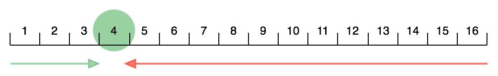]

???

In this case it's easy to proove mathematically: isqrt of N is less than half of the number.

---

# Example: find number in an array

.row[
.left-column[
### Input
]
.right-column[
```

Array : [153, 934, -493, 1, 83, 0, 1000]

Number: 123
```
]
]

--
.row[
.left-column[
### Algorithm
]
.right-column[
```
int find(int array[], int n, int x) {
	for (int i = 0; i < n; i++) {
		if (x == array[i]) {
			return 1;
		}
	}
	return 0;
}
```
]
]

---

# Analyzing `find-number` example

- For the `find-number` problem *size* is number of elements in the array
- For any given array of size `N` we may have *good* or *bad* inputs
    - element `x` may be the first in the array
    - element may not be present in the array

---

class: asymptotic, lower

# Asymptotic notation: Intuition

.row[
.left-column[
### Function
]
.right-column[
.math[$$f(x) = 100x + x^2 + 20\log(x)$$]
]
]

.row[
.left-column[
### Fastest growing addend
]
.right-column[
.math[$$x^2$$]
]
]

.row[
.left-column[
### Upper bound
]
.right-column[
.math[$$2x^2$$]
]
]

???

- An intuition behind an asymptotic notations is to have some mechanism to compare funtions growth
- Smth like 'order of magnitude' for a numbers adopted to the functions case

---

# Big-O notation

- Most commonly used asymptotic notation
- 'Order of magnitude' for functions
- Defines an *asymptotic upper bound*

---

class: lower

# Big-O notation: Definition

### $$f(x) = O(g(x))$$ *when* $$\exists\ c, x':\quad0 \le f(x) \le cg(x)\quad\forall\ x > x'$$
 
---

# Big-O notation

.plot[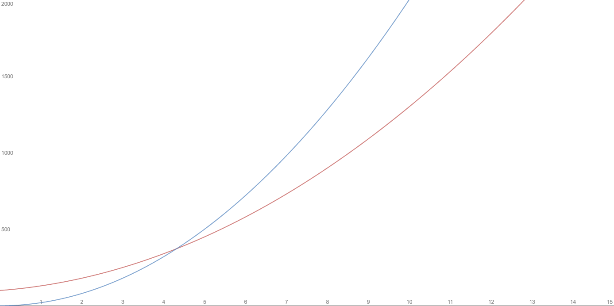]

---

class: bigo

# Big-O notation: Applications

.row[
.left-column[
### Constant
]
.right-column[
.math[$$O(1)$$]
]
]

.row[
.left-column[
### Linear
]
.right-column[
.math[$$O(N)$$]
]
]

.row[
.left-column[
### Squared
]
.right-column[
.math[$$O(N^2)$$]
]
]

.row[
.left-column[
### Polynomial
]
.right-column[
.math[$$O(N^a)$$]
]
]

.row[
.left-column[
### Logarithmic
]
.right-column[
.math[$$O(\log(N))$$]
]
]

.row[
.left-column[
### Exponential
]
.right-column[
.math[$$O(a^N)$$]
]
]

---

class: bigo

# Constant time

## .math[$$O(1)$$]

```
int isAnswer(long n,  long x) {
    return x * x <= n && (x + 1) * (x + 1) > n;
}
```

---

class: bigo

# Linear

## .math[$$O(N)$$]

```
int find(int array[], int n, int x) {
	for (int i = 0; i < n; i++) {
		if (x == array[i]) {
			return 1;
		}
	}
	return 0;
}
```

---

class: bigo

# Squared

## .math[$$O(N^2)$$]

```
int findDuplicate(int array[], int n) {
    for (int i = 0; i < n - 1; i++) {
		for (int j = i + 1; i < n; i++) {
			if (array[i] == array[j]) {
			    return 1;
			}
		}
	}
	return 0;
}
```

---

class: bigo

# Logarithmic

## .math[$$O(\log(N))$$]

```
int findInSortedArray(int array[], int from, int to, int x) {
	if (to - from < 2) {
		return x == array[from];
	}
	int middle = (to + from) / 2;
	return x < array[middle]
		? findInSortedArray(array, from, middle, x)
		: findInSortedArray(array, middle, to, x);
}
```

---

class: bigo-more

# More examples

.row[
.left-column[
```
void foo(int n) {
  prepareData(); // linear
  processData(); // linear
  outputResult(); // constant
}
```
]
.right-column[
.math[$$O(N)$$]
]
]

.row[
.left-column[
```
void foo(int n) {
  for (int i = 0; i < n; i++) {
    process(); // log(N)
  }
  outputResult(); // constant
}
```
]
.right-column[
.math[$$O(N\log(N))$$]
]
]

---

class: lower

# Tricky cases

- Recursion
- Amortized analysis

---

class: title, center, middle
 
# Data Structures

---

class: lower, avi

# Abstraction vs Implementation

.row[
.left-column[
### Abstract Data Type
]
.right-column[
- Is defined by operations it supports
- May be implemented in different ways
]
]

.row[
.left-column[
### Data Structure
]
.right-column[
- Is defined by it's implementation
- Describes actual data types and dependencies organization
]
]

---

class: bb

# Building blocks

.left-column[
- Scalar
]
.right-column[
- a variable of a primitive type
- all basic operations are `O(1)`
    - write, read, compare
    - add, multiply, bitwise operations

```
int a = 42;
```
]

---

class: bb

# Building blocks

.left-column[
- Scalar
- Structure
]
.right-column[
- way of grouping multiple elements
- accessing each element is `O(1)` operation

```
struct Point {
	int x;
	int y;
};

struct Point p = {.x = 4, .y = 2};
```
]

---

class: bb

# Building blocks

.left-column[
- Scalar
- Structure
- Pointer
]
.right-column[
- same data can be referenced by multiple pointers
- accessing referenced element is `O(1)` operation

```
struct Interval {
	struct Point * a;
	struct Point * b;
};
```
]

---

class: bb

# Building blocks

.left-column[
- Scalar
- Structure
- Pointer
- Array
]
.right-column[
- accessing element is `O(1)` operation
- can be multidimensional

```
int array[10][2];
```
]

---

# Space complexity

- Constant
- Linear
- Squared

---

# ADT: Queue

- *FIFO* — first in, first out
- Operations
    - `push()` add element to the end of the queue
    - `pop()` take an element from the beginning of the queue

---

# ADT: Stack

- *LIFO* — last in, first out
- Operations
    - `push()` put an element on the top of the stack
    - `pop()` take an element from the top of the stack


---

# ADT: Deque

- *Double ended queue*
- Operations
    - `pushFirst()` add an element to the beginning of the deque
    - `popFirst()` take an element from the beginning of the deque
    - `pushLast()` add an element to the end of the deque
    - `popLast()` take an element from the end of the deque

---

class: adts

# Queue, Stack, Deque

.ll[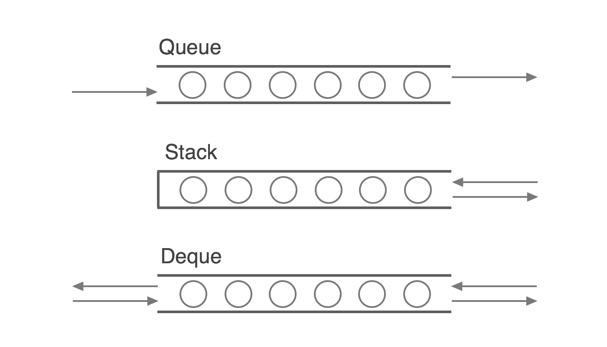]

---

class: doa

# Deque on array

.left-column[
- Structure
]
.right-column[
```
typedef struct Deque Deque;

struct Deque {
	int arr[100];
	int size;
};
```
]

---

class: doa

# Deque on array

.left-column[
- Structure
- `pushLast()`, `popLast()`
]
.right-column[
```
void pushLast(Deque *d, int element) {
	d->arr[d->size] = element;
	d->size++;
}

int popLast(Deque *d) {
	d->size--;
	return d->arr[d->size + 1];
}
```
]

---

class: doa

# Deque on array

.left-column[
- Structure
- `pushLast()`, `popLast()`
- `pushFirst()`, `popFirst()`
]
.right-column[
```
void pushFirst(Deque *d, int element) {
	d->size++;
	for (int i = d->size - 1; i > 0; i--) {
		d->arr[i] = d->arr[i - 1];
	}
	d->arr[0] = element;
}

int popFirst(Deque *d) {
	int result = d->arr[0];
	d->size--;
	for (int i = 0; i < d->size; i++) {
		d->arr[i] = d->arr[i + 1];
	}
	return result;
}
```
]

---

# Array: insert element

.ll[]

---

# Array: insert element

.ll[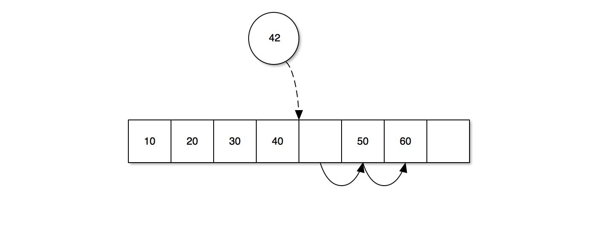]

---

# Array: insert element

.ll[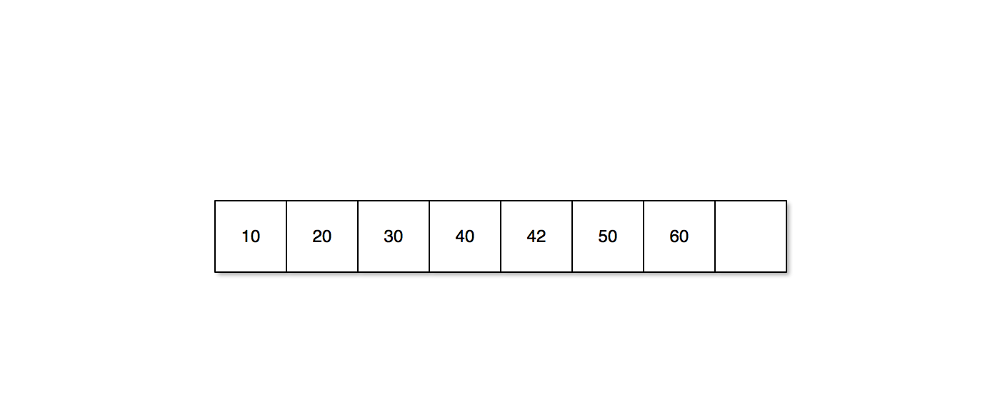]

---

# Singly Linked List

.ll[]

---

# Singly Linked List: Defining Types 

```
typedef struct Node Node;
typedef struct List List;

struct Node {
	int value;
	Node *next;
};

struct List {
	Node *head;
	Node *last;
};

List * empty() {
	Node * head = (Node *) malloc(sizeof(Node));
	List * list = (List *) malloc(sizeof(List));
	list->head = head;
	list->last = head;
	return list;
}
```

---

# Singly Linked List: Add Element

.ll[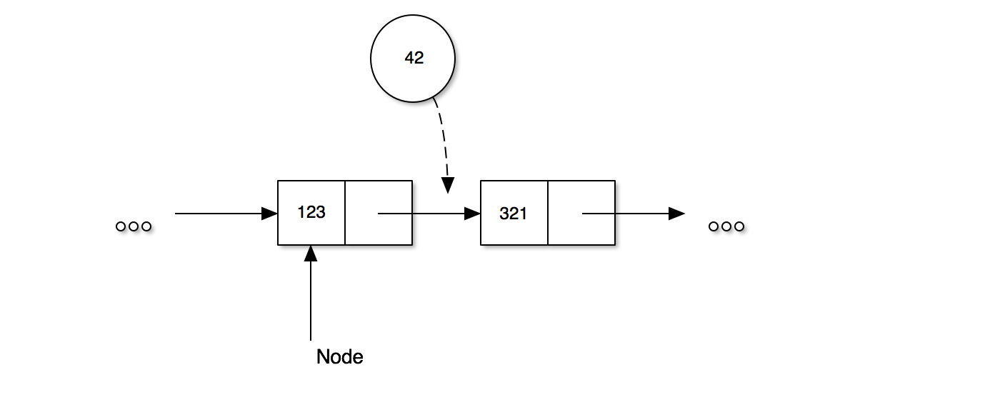]

---

# Singly Linked List: Add Element

.ll[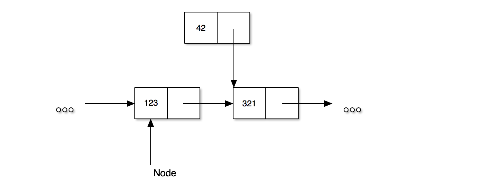]

---

# Singly Linked List: Add Element

.ll[]

---

# Singly Linked List: Add Element

.ll[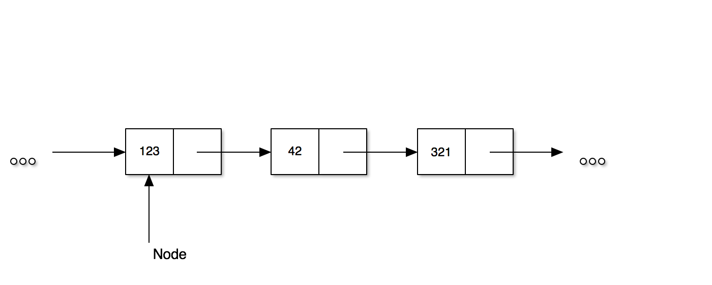]

---

class: dosll

# Deque on Singly Linked List

.left-column[
- `addElementAfter()`
]
.right-column[
```
void addElementAfter(Node * node, int value) {
	Node * newNode =
	    (Node *) malloc(sizeof(Node));
	newNode->next = node->next;
	newNode->value = value;
	node->next = newNode;
}
```
]

---

class: dosll

# Deque on Singly Linked List

.left-column[
- `addElementAfter()`
- `removeElementAfter()`
]
.right-column[
```
int removeElementAfter(Node * node) {
	Node * toRemove = node->next;
	node->next = toRemove->next;
	int result = toRemove->value;
	free(toRemove);
	return result;
}
```
]

---

class: dosll

# Deque on Singly Linked List

.left-column[
- `addElementAfter()`
- `removeElementAfter()`
- `pushFirst()`, `pushLast()`
]
.right-column[
```
void pushFirst(List * list, int value) {
	addElementAfter(list->head, value);
	if (list->head == list->tail) {
		list->tail = list->head->next;
	}
}

void pushLast(List * list, int value) {
	addElementAfter(list->tail, value);
	list->tail = list->tail->next;
}
```
]

---

class: dosll

# Deque on Singly Linked List

.left-column[
- `addElementAfter()`
- `removeElementAfter()`
- `pushFirst()`, `pushLast()`
- `popFirst()`, `popLast()`
]
.right-column[
```
int popFirst(List * list) {
	return removeElementAfter(list->head);
}

int popLast(List * list) {
	Node * cursor = list->head;
	while (cursor->next != list->tail) {
		cursor = cursor->next;
	}
	list->tail = cursor;
	return removeElementAfter(cursor);
}
```
]

---

# Doubly Linked List

.ll[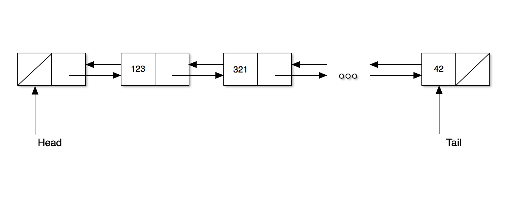]

---

# Doubly Linked List: Add Element

.ll[]

---

# Doubly Linked List: Add Element

.ll[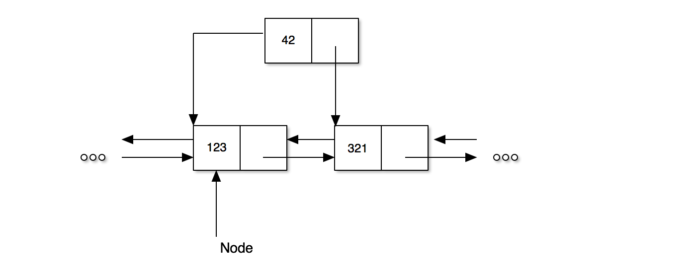]

---

# Doubly Linked List: Add Element

.ll[]

---

# Doubly Linked List: Add Element

.ll[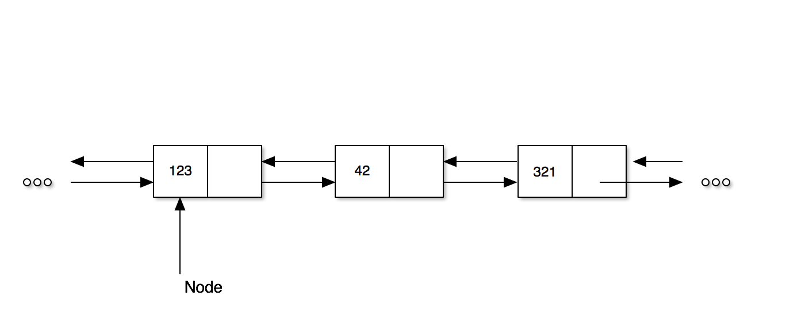]

---

class: title, center, middle

# Questions!
